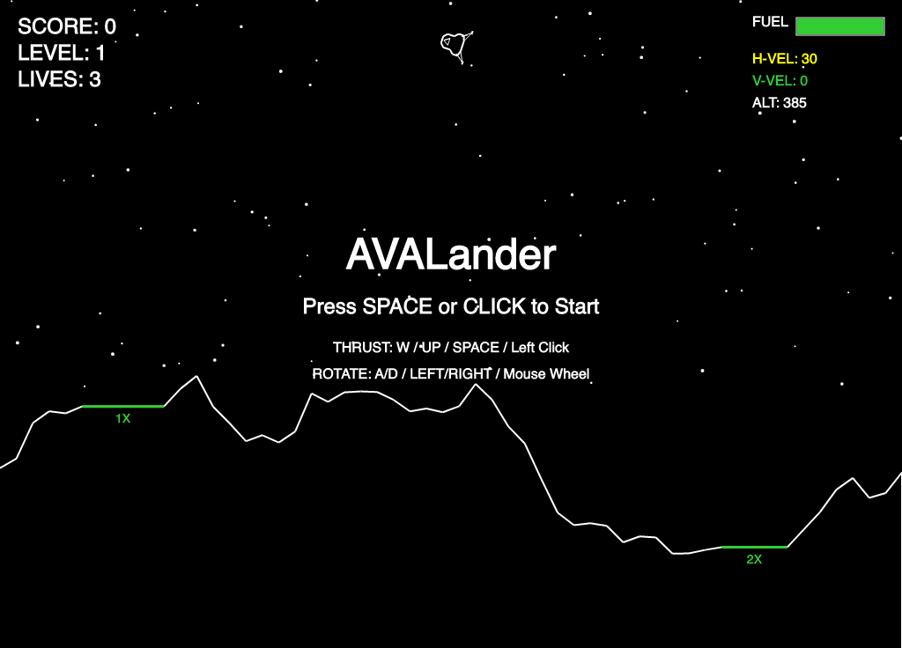
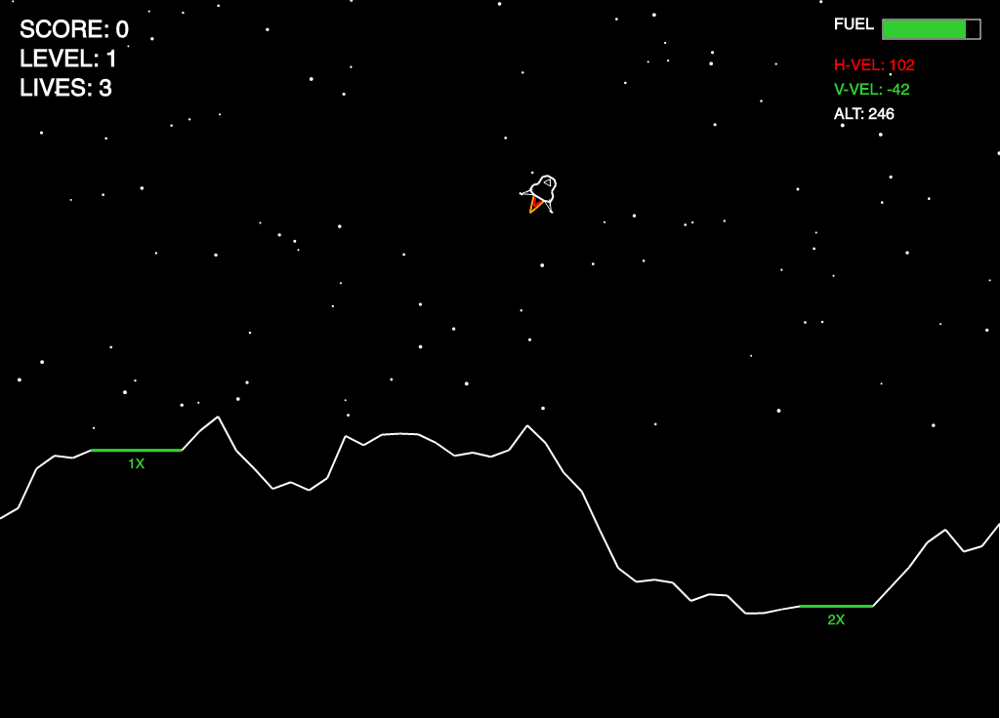
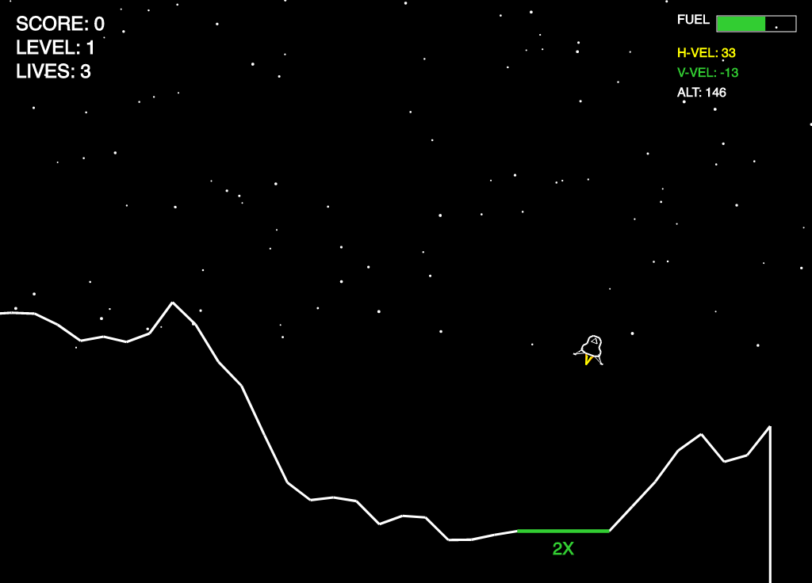
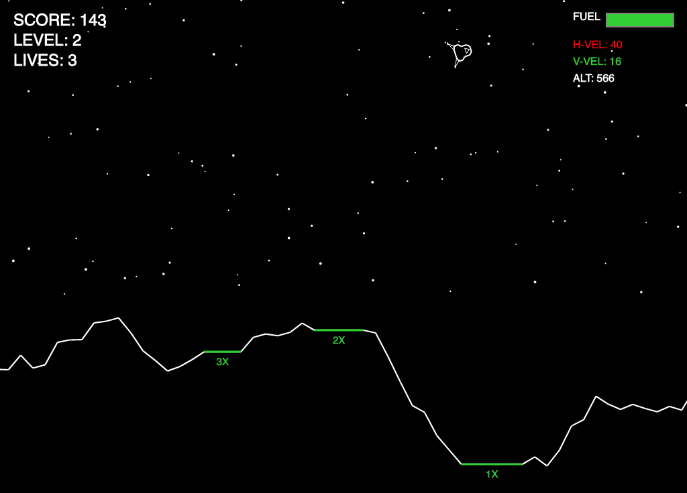

# AVALander

A classic Lunar Lander clone built with **Avalonia UI** and **.NET 9**, featuring retro wireframe vector graphics inspired by the original 1979 arcade aesthetic.

This project uses the same audio and controller support libraries as [AVARoids](https://github.com/Harlock123/AVARoids).

## Features

- **Retro Wireframe Graphics** - Authentic vector-style visuals with white lines on black background
- **Cross-Platform** - Runs on Windows, macOS, and Linux via Avalonia UI
- **Gamepad Support** - Full SDL2 controller support (Xbox, PlayStation, Nintendo Switch Pro, etc.)
- **Audio** - Thruster sounds and explosion effects via NetCoreAudio
- **Progressive Difficulty** - Terrain becomes more challenging with each level
- **Physics Simulation** - Realistic gravity, thrust, and rotation mechanics
- **Multiple Landing Pads** - Score multipliers (1X to 5X) based on pad difficulty
- **Fuel Management** - Limited fuel adds strategic depth
- **Real-time HUD** - Displays velocity, altitude, fuel, score, and lives

## Screenshots









## Requirements

- [.NET 9.0 SDK](https://dotnet.microsoft.com/download/dotnet/9.0)
- SDL2 libraries (for controller support)

### Linux (Debian/Ubuntu)
```bash
sudo apt install libsdl2-2.0-0
```

### macOS (Homebrew)
```bash
brew install sdl2
```

### Windows
SDL2 is bundled automatically via NuGet.

## Building and Running

```bash
# Clone the repository
git clone https://github.com/yourusername/AVALander.git
cd AVALander

# Build
dotnet build

# Run
dotnet run --project AVALander
```

## Controls

### Keyboard

| Action       | Keys                |
|--------------|---------------------|
| Thrust       | W, Up Arrow, Space  |
| Rotate Left  | A, Left Arrow       |
| Rotate Right | D, Right Arrow      |
| Pause        | Escape              |
| Start/Restart| Space, Enter        |
| Screenshot   | Ctrl+S              |

### Mouse

| Action       | Control             |
|--------------|---------------------|
| Thrust       | Left Click          |
| Rotate       | Mouse Wheel         |
| Start        | Left Click          |

### Gamepad

| Action       | Buttons                          |
|--------------|----------------------------------|
| Thrust       | A Button, Right Trigger          |
| Rotate Left  | D-Pad Left, Left Stick Left      |
| Rotate Right | D-Pad Right, Left Stick Right    |
| Pause        | Start                            |
| Resume       | Start                            |
| Quit (Paused)| Back/Select                      |
| Restart      | A Button, Start                  |

## Gameplay

### Objective
Land your lunar module safely on the designated landing pads (shown in green) to score points and advance to the next level.

### Safe Landing Requirements
- **Speed**: Vertical and horizontal velocity must be below 40 units
- **Angle**: Lander must be within 15° of vertical
- **Position**: Both landing feet must be on a landing pad

### Scoring
- Base landing score: **50 points × pad multiplier** (1X to 5X)
- Fuel bonus: **1 point per 10 fuel remaining**
- Smaller pads offer higher multipliers but are harder to land on

### HUD Display
- **SCORE** - Current score
- **LEVEL** - Current level
- **LIVES** - Remaining lives (start with 3)
- **FUEL** - Fuel gauge (green/yellow/red based on remaining fuel)
- **H-VEL** - Horizontal velocity (green = safe, red = dangerous)
- **V-VEL** - Vertical velocity (green = safe, red = dangerous)
- **ALT** - Altitude above terrain

### Tips
- Use short thrust bursts to conserve fuel
- Kill horizontal velocity before attempting to land
- Watch the velocity indicators - green means safe landing speed
- Higher levels start with initial horizontal drift

## Project Structure

```
AVALander/
├── AVALander.sln
├── README.md
└── AVALander/
    ├── AVALander.csproj
    ├── Program.cs
    ├── App.axaml
    ├── App.axaml.cs
    ├── MainWindow.axaml
    ├── MainWindow.axaml.cs
    ├── Engine/
    │   ├── ControllerManager.cs   # SDL2 gamepad input
    │   ├── GameEngine.cs          # Core game logic
    │   ├── InputHandler.cs        # Keyboard + controller abstraction
    │   └── SoundManager.cs        # Audio playback
    ├── Models/
    │   ├── Explosion.cs           # Crash explosion effect
    │   ├── GameObject.cs          # Base game object class
    │   ├── Lander.cs              # Lunar module physics & rendering
    │   ├── LandingPad.cs          # Landing zone definition
    │   ├── Particle.cs            # Particle effect system
    │   └── Terrain.cs             # Procedural terrain generation
    ├── Views/
    │   └── GameCanvas.cs          # Avalonia rendering & game loop
    └── Sounds/
        ├── Explosion.wav
        ├── Landing.wav
        ├── Thruster.wav
        └── Warning.wav
```

## Dependencies

| Package | Version | Purpose |
|---------|---------|---------|
| Avalonia | 11.2.1 | Cross-platform UI framework |
| Avalonia.Desktop | 11.2.1 | Desktop platform support |
| Avalonia.Themes.Fluent | 11.2.1 | UI theming |
| NetCoreAudio | 2.0.0 | Cross-platform audio playback |
| ppy.SDL2-CS | 1.0.741-alpha | SDL2 bindings for controller support |

## Acknowledgments

- Inspired by the original **Lunar Lander** (1979) by Atari
- Audio and controller architecture based on [AVARoids](https://github.com/Harlock123/AVARoids)
- Built with [Avalonia UI](https://avaloniaui.net/)

## License

MIT License - See LICENSE file for details.
